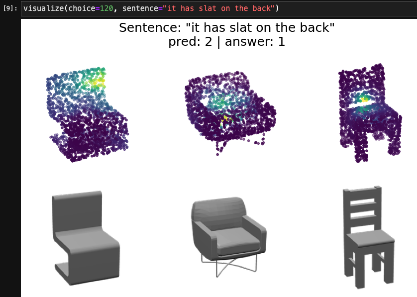

# Transglot: Learning Local Parts of 3D Structure from Language


## Introduction
Transglot is a extended version of Shapeglot. It can extract local regions corresponding to a given sentence with a cross-attention mechanism.
This work explores if our model can find a local part of the 3D structure from natural language.
From attention maps, we can see that Transglot focuses on a local part related with a given sentence.
It is similar with the part segmentation of the shapes even Transglot isn't provided any part labels nor part segmentation supervision.

## Requirements
Install with `pip install -e .`. This implementation is built using some libraries, pytorch-lightning and hydra.

CUDA: 11.2

## Usage
1. To download the data, please run the following command. You first need to accept the Term Of Use
   [here](https://docs.google.com/forms/d/e/1FAIpQLScyV1AsZsfthqiPhuw6MFL1JZ4p8GSDPIj8uwH0BRWQl3tejw/viewform).
   Upon review, Shapeglot authors will email to you the necessary link that you need to put inside
   the designated location of the download_data.sh file.
   ```
   sh download_data.sh
   ```
   If you can't download "shapenet_chairs_only_in_game.h5" with the command above, 
   you can download it [here](https://drive.google.com/drive/folders/1e9LpP0NuKMTMLABVOkoiz1elMd-oAgC-?usp=sharing).
   It's the pc data that I sampled from the meshes in ShapeNet with trimesh.
2. To tokenize and prepare the ChairinCotext dataset, please run 
   `transglot/notebooks/prepare_chairs_in_context_data.ipynb`
## Train

```
# You can select some options. 
# pn: PointNet, pn2: PointNet++, pt: Point Transformer, pct: Point Cloud Transformer
python train.py embedding_dim=100 hidden_dim=256 attn_layers=1 num_heads=1 \
pc_encoder_type=["pn", "pn2", "pt", "pct"] \
batch_size=96 epochs=35 lr=1e-3 weight_decay=5e-3 
```

## Test
`python test.py`

I attached a checkpoint of trained model. The above command tests the uploaded model.
If you want to test your own trained model, you should edit a "sub_ver_dir" path in the test.py.
For more details, please refer to comments in the test.py.

trained model: embedding_dim=100, hidden_dim=256, attn_layers=1, num_heads=1, pc_encoder_type=pn

## Visualize Attention Maps
You can visualize attention maps of Transglot in the `visualization.ipynb`. In that, you can also test 
your own synthesized sentences. (only lowercase available.)


## Experiment Results
### Performance of architectures
| Architecture | Test Acc (%) | Test Loss | Train Acc (%) |
| ------------ | -------- | --------- | --------- |
| Baseline     | __79.5__     | __0.6101__    | 91.5      |
| head=1       | 78.0     | 0.6602    | 94.6      |
| head=8       | 76.0     | 0.9272    | __95.4__      |

As shown the table above, more capability of the architecture increased overfitting.
### Part segmentation from language
| Given Word \ Part  | back | seat | leg | arm |
| :--------: | ---  |----- | --- | --- |
| back | 20.35 | 0.43  | 0.14  | 1.44  |
| seat | 40.21 | 20.86 | 3.98  | 7.64  |
| leg  | 1.35  | 1.49  | 14.93 | 0.83  |
| arm  | 0.34  | 7.54  | 3.6   | 4.85  |

__mIOU(%) scores with the binarized attention map and the ground truth.__
Each row and column indicates the name of the label inserted as input and an actual part area
respectively. I also uploaded the code for calculating IoU in `iou_calculate.ipynb`.

## Reference
This code is based on some open sources below.
* https://github.com/optas/shapeglot
* https://github.com/erikwijmans/Pointnet2_PyTorch
* https://github.com/POSTECH-CVLab/point-transformer
* https://github.com/MenghaoGuo/PCT
* https://github.com/chrdiller/pyTorchChamferDistance

## License
This provided code is licensed under the terms of the MIT license (see LICENSE for details).


